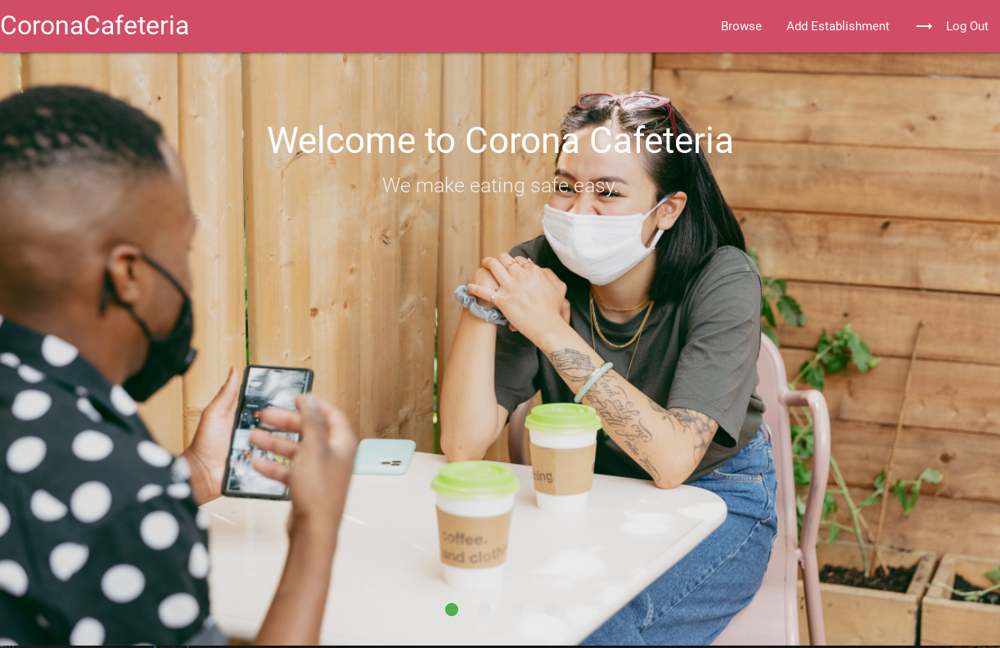
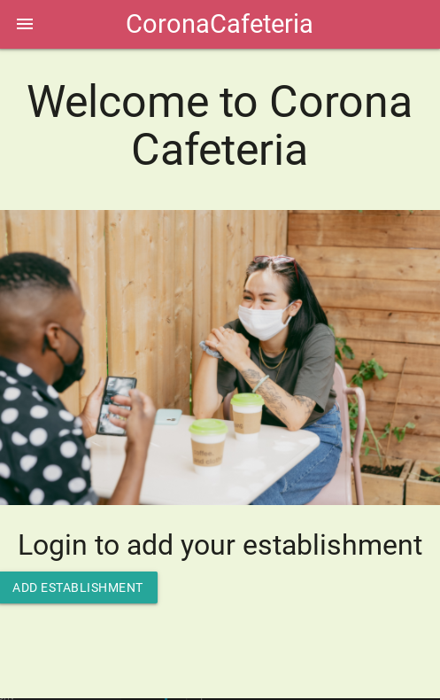
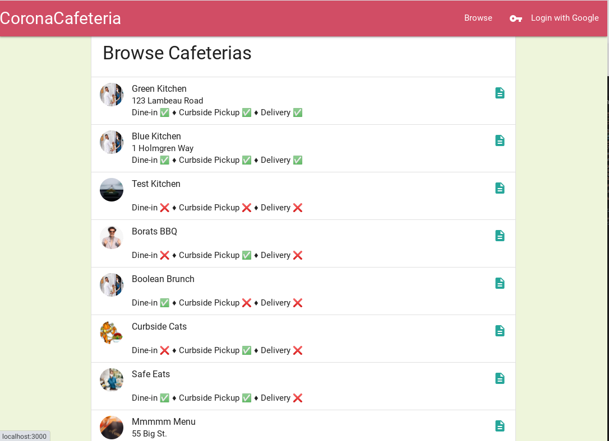
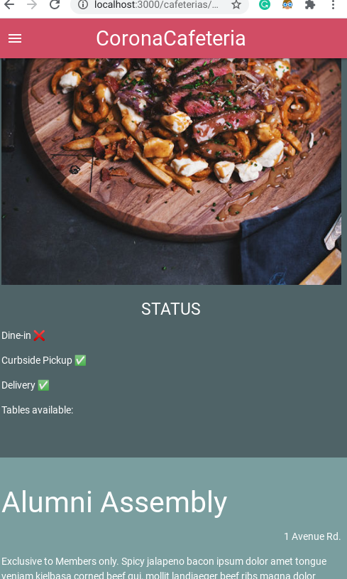
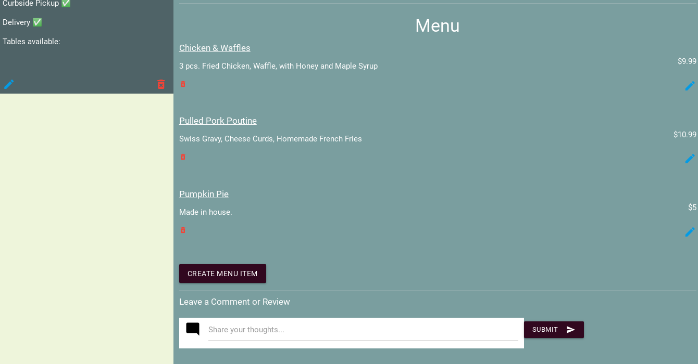

# Corona Cafeteria
This app is intended to allow users to create a restaurant/bar (establishment) that will be added to a connected database. From there one can edit the status of their establishment. Such as, if there is curbside pickup or tables available for dine-in in real time. Also, a menu can be created, edited and deleted in real time. Anyone can browse the site and all the establishments that have been saved to the database. If a user is logged in they can comment on individual establishments and delete their own comments if needed. The site has been optimized for both mobile and desktop.
---
### Screenshots
     

### Technologies Used:
- Node
- Express
- MongoDb
- Mongoose
- Materialize.css
- Passport
- Google Oauth
- CSS

### Getting Started
- [Corona Cafeteria App](https://corona-cafeteria.herokuapp.com/) 
- [Trello Board](https://trello.com/b/M60YEoGE/corona-cafeteria)

#### Next Steps:
- Add search functionality to Browse page
- Allow users to check-in and check-out of establishments (store those checkins in the establishment model)
- Aloow users to like and or comment on other user comments
- Add map functionality through an API like Google Maps

